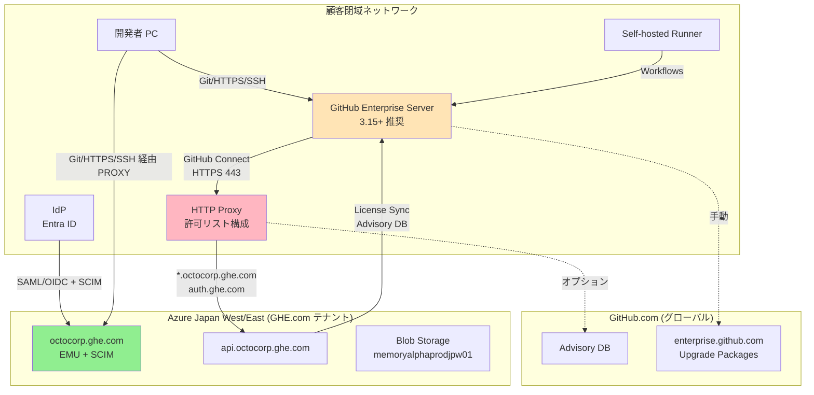
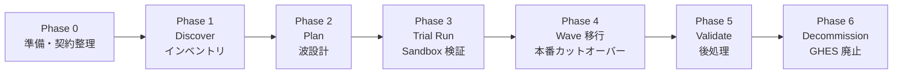

# GitHub Enterprise Server → GitHub Enterprise Cloud with Data Residency 移行パス調査レポート

> **対象シナリオ:** 現在 Volume Licensing (VL) 契約の GHES から、Metered Billing への切替えを伴う GHE.com (Data Residency) への段階的移行。閉域 GHES と GitHub Connect の併用を前提にした実務観点の整理。

---

## Executive Summary

- **GHE.com (Data Residency) は GHEC のリージョン特化版** で、専用サブドメイン (`SUBDOMAIN.ghe.com`) で提供されるフルマネージド SaaS。EU・米・豪・**日本**の 4 リージョンで GA 済み[^1][^2]。**EMU (Enterprise Managed Users) が必須**で、IdP (Entra ID 推奨) からの SCIM プロビジョニングが前提となる[^3]。
- **GHE.com は内在的に Metered (Usage-based) 課金プラットフォーム** に固定されており、従来の Volume/Subscription (VL) では新規購入できない[^4][^5]。Microsoft Enterprise Agreement (EA) 経由ユーザは Copilot / GHAS / Codespaces / Actions 超過分を使う際、**Azure Subscription 連携が事実上必須**[^6]。
- **GHES → GHE.com は GitHub Connect で「橋渡し」しながら段階移行できる**。GHES 3.12+ で GHE.com への接続可、**自動ライセンス同期は GHES 3.15+ が必須**[^7][^8]。GitHub Connect 経由で利用できない機能は `Server Statistics` と `GitHub.com Actions` の 2 つのみ[^7]。
- **閉域 GHES でも GHE.com 連携は可能だが、特定のホスト (`SUBDOMAIN.ghe.com`, `api.SUBDOMAIN.ghe.com`, `uploads.SUBDOMAIN.ghe.com`, `auth.ghe.com` ほか) と Azure Japan の CIDR (`74.226.88.192/28` 等) を HTTP プロキシ経由で許可する必要**がある。**Azure ExpressRoute / PrivateLink での GHE.com 到達はサポートされない**(パブリックインターネットのみ)[^9][^10]。
- **移行ツールは GitHub Enterprise Importer (GEI / `gh gei`) が公式の唯一手段**。`--target-api-url https://api.SUBDOMAIN.ghe.com` を付けるだけで GHE.com を宛先にできる[^11][^12]。Actions secret / 環境 / Self-hosted Runner / Packages / LFS オブジェクト / GitHub Apps は **移行されないため再構築が必要**[^13]。
- **段階移行の標準形は「Discover → Plan → Trial → Wave 移行 → Decommission」の 6 フェーズ**で、Wave 0 (POC) → 主要組織 → ロングテールの順に進める。ハイブリッド期間は GitHub Connect でライセンス重複を回避しつつ Unified Search / Unified Contributions を活用する[^14]。

---

## 1. 用語・前提整理

### 1.1 GHE.com (Enterprise Cloud with Data Residency) の位置付け

GitHub の現時点でのエンタープライズ提供形態は次の 3 つ[^1][^2][^15]。

| 形態 | ホスト | データ所在地 | EMU | 用途 |
|---|---|---|---|---|
| **GHEC (Standard)** | `github.com` | 米国 | オプション | 既定のクラウド |
| **GHE.com (Data Residency)** | `SUBDOMAIN.ghe.com` | EU / AU / US / **JP** から選択 | **必須** | コンプライアンス・ガバナンス重視 |
| **GHES (Server)** | 顧客の任意ホスト | 顧客が制御 | 利用不可 | 自己ホスト・閉域・オフプレ |

GHE.com は **VL の延長線上には存在しない** クラウド SaaS であり、ライセンス・運用・URI 体系のすべてが GHES から離れる別物として設計されている。

### 1.2 主要 URL の差分 (GHES vs GHE.com vs github.com)

| 用途 | github.com | GHES | GHE.com |
|---|---|---|---|
| Web UI | `github.com` | `ghes.example.co.jp` | `octocorp.ghe.com` |
| REST/GraphQL API | `api.github.com` | `ghes.example.co.jp/api/v3` | `api.octocorp.ghe.com` |
| Container Registry | `ghcr.io` | (オプション) | `containers.octocorp.ghe.com` |
| Git SSH | `git@github.com` | `git@ghes.example.co.jp` | `octocorp@octocorp.ghe.com` ⚠️ ユーザー名がサブドメイン |
| Actions OIDC issuer | `token.actions.githubusercontent.com` | (各サーバー固有) | `token.actions.octocorp.ghe.com` |
| SCIM テナント | `api.github.com/scim/...` | n/a | `api.octocorp.ghe.com/scim/v2/enterprises/octocorp` |

⚠️ **OIDC issuer が変わるため、AWS / Azure / GCP の federated trust ポリシーは全件書き換えが必要**[^16]。

### 1.3 GHE.com で使えない / 制限される機能

[^17] より抽出 (移行計画で重要なもの):

**現時点で利用不可 (将来サポート予定):**
- macOS GitHub-hosted runner
- GitHub Packages の Maven / Gradle
- リポジトリトラフィック・メトリクス
- GitHub Marketplace (UI 経由のインストール)
- Migrations REST API (GraphQL は使用可)
- 監査ログの S3 OIDC ストリーミング
- 組織レベル Dependency Insights

**永続的に利用不可 (EMU 由来の構造的制約):**
- パブリックリポジトリ (Internal はあり)
- Gist
- 「Import repository」ボタン (GEI を使う)
- Copilot Free / Pro 個人プラン

**GitHub Connect 経由で利用不可 (GHES → GHE.com 接続時):**
- Server Statistics
- GitHub.com Actions の自動取得 (※閉域なら `actions-sync` で手動同期は可能)

---

## 2. ライセンスモデル: Volume License → Metered Billing への切替

### 2.1 現状の Volume / Subscription (GHE Unified) モデル

[^4] および [^18] に基づく:

- 1 つの VL ライセンスで GHEC + GHES の両方をカバー (GHE Unified)
- GitHub Sales 経由の手動セットアップ・年次契約・固定シート数
- True-up は GHAS の active committer 超過時、追加ライセンスを別途購入
- すべての Standalone GHES は VL 上で運用される[^19]
- **EA 経由ユーザは、Copilot / GHAS / Codespaces / Actions 超過 / Packages 超過 / LFS 超過の利用には Azure Subscription 連携が必須** (GitHub のドキュメントでは "the only way" と明記)[^6]

### 2.2 Metered (Usage-based) モデルと GHE.com の関係

[^5][^20] より:

- **2024 年 8 月 1 日以降に作成された新規エンタープライズは自動的に Metered**
- Cloud-first 原則: ユーザーをまず GHE.com 組織に割り当て、そこから GHES ライセンスファイルを **オンデマンドで生成** (有効期間 1 年)
- Server-only ユーザー (GHES のみ存在) は GHE Metered の追加課金対象だが、メールアドレス突合で重複排除
- Azure 請求サイクル (毎月 1 日締め)、使用量データは日次で Azure に送信
- GitHub の請求は **MACC (Microsoft Azure Consumption Commitment) 対象**[^21]

### 2.3 GHE.com 契約・支払の選択肢

[^1] に明記:

| 支払方法 | EA 顧客 | 直接顧客 |
|---|---|---|
| クレジットカード / PayPal | × (EA 経由なら原則不可) | ◎ |
| **Azure Subscription** | **◎ (実質必須)** | ◎ |

> "If you use GitHub Enterprise Cloud through a Microsoft Enterprise Agreement, connecting an Azure subscription is the only way to use GitHub Advanced Security, GitHub Codespaces, or GitHub Copilot, or to use GitHub Actions, Git Large File Storage (LFS), or GitHub Packages beyond your plan's included amounts."[^6]

### 2.4 VL → Metered 切替のタイミング

[^22] にあるとおり、**自己サービスでの中途切替はできない**:

> "If you currently pay for your GitHub Enterprise licenses through a volume, subscription, or prepaid agreement, you will continue to be billed in this way until your agreement expires or you are invited to transition. At renewal, you have the option to switch to the metered billing model."

**切替えの 2 つのトリガー:**
1. **更新タイミングでの切替**: 契約満了で Metered を選択
2. **GitHub からの「invitation to transition」**: GHE.com 採用時など、Sales が中途切替を提案

⚠️ Visual Studio バンドル契約のシートは **VL のまま据え置かれる**ため、別途 GitHub Sales / Microsoft アカウントマネージャと事前調整が必要[^5]。

### 2.5 切替手順 (推奨フロー)

```mermaid
flowchart TD
    A[現状: VL 契約 + GHES のみ] --> B[GitHub Sales / Microsoft AE と協議<br/>VS バンドルの分離・移行ウィンドウ]
    B --> C[Azure Subscription を準備<br/>Owner 権限 + Tenant Admin Consent]
    C --> D[GHEC エンタープライズに Azure Sub を接続<br/>(SPV App インストール・Tenant 全体合意)]
    D --> E{Copilot/GHAS/Actions 超過<br/>を Metered で利用開始}
    E --> F[GHE.com トライアル開始 (30 日)<br/>サブドメイン確定 + EMU IdP 構成]
    F --> G[更新タイミング or invitation で<br/>シート契約を VL → Metered 切替]
    G --> H[GHES → GHE.com 移行 (GEI)]
    H --> I[GHES 廃止 / 契約クローズ]
```

**重複課金回避のポイント:**
- GitHub Connect + Auto License Sync (GHES 3.15+) を**先に**有効化
- IdP 由来のメールアドレスを GHES プライマリメールに揃える (EMU では IdP 制御)
- ユーザの GHES アカウントは「移行完了後すぐに削除」する必要なし。**Suspend (停止)** で十分 (停止ユーザーはライセンスを消費しない)[^23]
- Azure Sub 接続日を月初に揃えて、サイクル跨ぎの二重請求を最小化[^24]

---

## 3. 閉域 GHES と GitHub Connect の要件整理

### 3.1 GitHub Connect が提供する機能 (GHE.com ターゲット時)

[^7] のフィーチャ表より:

| 機能 | github.com 接続 | **GHE.com 接続** | 備考 |
|---|---|---|---|
| 自動ユーザーライセンス同期 | ✅ | ✅ (**GHES 3.15+ 必須**) | 週次同期 |
| Dependabot alerts | ✅ | ✅ | Advisory DB を 1 時間ごとに pull |
| Dependabot updates | ✅ | ✅ | Self-hosted runner 必要 |
| Unified search | ✅ | ✅ | GHES から GHE.com を検索 (一方向) |
| Unified contributions | ✅ | ✅ | 匿名化したコントリビューション数 |
| Server Statistics | ✅ | ❌ | GHE.com では非対応 |
| GitHub.com Actions 自動取得 | ✅ | ❌ | 必要なら `actions-sync` で手動 |

**重要な保証:**
> "GitHub Connect does not open your GitHub Enterprise Server instance to the public internet. None of your enterprise's private data is exposed to GitHub Enterprise Cloud users."[^7]
- すべての通信は **GHES 起点のアウトバウンド** (HTTPS, ports 443/80, TLS)
- **コードは GHES から外に出ない** (Dependabot 含む)

### 3.2 GHES 必須バージョン早見表

| 用途 | 最低 GHES バージョン | 出典 |
|---|---|---|
| GitHub Connect → GHE.com (基本) | **3.12+** | [^25] |
| 自動ユーザーライセンス同期 → GHE.com | **3.15+** | [^8] |
| GEI のソースとして利用可能 | **3.4.1+** (3.5+ で Releases も移行) | [^11] |
| GEI ローカルストレージ (S3/Azure Blob 不要) | **3.16+** | [^11] |
| メータード GHAS 課金 (Connect 経由) | **3.13+** | [^26] |
| 単一リポジトリの最大サイズ 40 GiB | **3.13+** (Public Preview) | [^13] |

### 3.3 GitHub Connect 用アウトバウンド許可リスト

#### 3.3.1 ターゲットが **GHE.com** の場合 (`SUBDOMAIN` を実テナント名に置換)

[^9][^10] より:

```text
# GitHub Connect (最小セット)
SUBDOMAIN.ghe.com
api.SUBDOMAIN.ghe.com
uploads.SUBDOMAIN.ghe.com
auth.ghe.com

# 全機能 (Pages / Actions / アセット / Blob)
*.SUBDOMAIN.ghe.com
*.pages.SUBDOMAIN.ghe.com
*.actions.SUBDOMAIN.ghe.com
*.githubassets.com
*.githubusercontent.com
*.blob.core.windows.net
```

#### 3.3.2 GHE.com **日本リージョン** の Azure CIDR (FQDN ベースで足りない場合)

[^9] より、現時点 (2026 年 5 月時点) の値:

| 方向 | CIDR |
|---|---|
| **Egress (GHE.com → 外)** | `74.226.88.192/28` |
| Egress | `40.81.180.112/28` |
| Egress | `4.190.169.192/28` |
| **Ingress (外 → GHE.com)** | `74.226.88.240/28` |
| Ingress | `40.81.176.224/28` |
| Ingress | `4.190.169.240/28` |

> ⚠️ CIDR は変更されることがあるため、本番ファイアウォール構成では **`api.SUBDOMAIN.ghe.com/meta` の `github_enterprise_importer` キー** で常に最新化することが推奨される。

#### 3.3.3 GHES 自身の運用に必要なアウトバウンド (推奨)

```text
enterprise.github.com                      # GHES アップグレードパッケージ
github-enterprise.s3.amazonaws.com         # 自動アップデートチェック (オプション)
ghcr.io                                     # Dependabot 用コンテナイメージ
```

完全エアギャップ運用なら、これらのいずれもオフラインで取得して手動投入する運用が成立する[^27]。

### 3.4 プロキシ要件 (重要)

[^28] より:

- **GHES の "HTTP Proxy Server" 設定はプロキシへの接続に HTTP を使う形式** (HTTPS は CONNECT トンネル化される)
- **Actions が有効なエンタープライズでは、HTTP プロキシのみサポート**。SOCKS5 と HTTPS プロキシは非対応
- 例外ホストはカンマ区切りで除外可 (例: `.internal,.octocorp.ghe.com`)

### 3.5 TLS 検証 / 証明書

[^9] より:

- GHE.com の `*.ghe.com` 証明書は **公的 CA 署名済み** で、CT (Certificate Transparency) にも公開される
- GHES の OS 信頼ストアにそのまま乗るため、**GHE.com 用 CA を別途インポートする必要はない**
- 例外: 顧客側で **TLS 復号プロキシ (SSL inspection)** を運用している場合は、その内部 CA を GHES の信頼ストアに登録する必要あり (Management Console → Privacy → Custom CA Root Certificate)

### 3.6 ExpressRoute / PrivateLink での GHE.com 到達

**サポートされない**[^9]:

- GHE.com は **マルチテナント SaaS**。テナント面 (Web/API) は **パブリックインターネット経由のみ**
- ドキュメントで言及されている「Azure Private Networking」は **GitHub-hosted Actions runner を顧客 VNet にインジェクトする機能** であり、テナント本体への private endpoint ではない
- 必要に応じて **ExpressRoute Microsoft peering** で Azure 公開 IP に向けたルーティング最適化は可能

### 3.7 閉域 GHES が GitHub Connect 無しでもできること

GitHub Connect は **任意機能** であり、コア GHES 機能は完全オフラインで動作する[^7][^29][^30]:

| 機能 | GitHub Connect 必須 | オフライン代替 |
|---|---|---|
| Git / PR / Issues / Wikis | × | フルオフライン可 |
| GitHub Actions (self-hosted runner) | × | 外部 Blob 必要 (S3/Azure/GCS/MinIO) |
| Marketplace Action 取得 | × | `actions-sync` で `pull` → 物理転送 → `push`[^29] |
| Code Scanning (CodeQL) | × | `codeql-action-sync-tool` で bundle 同期[^31] |
| Secret Scanning (パターン) | × | パターン DB は GHES バンドル同梱 |
| Secret Scanning Validity Check | × (オプション) | 完全オフラインなら無効化可 |
| **Dependabot Alerts (Advisory DB)** | **○ 必須** | 代替なし (GHE.com から 1h ごと pull) |
| Dependency Graph / Review | × | 完全オフライン可 |
| GHES アップグレード | × | `.pkg`/`.hpkg` を手動転送 |

> **示唆:** 完全に閉域でも Code Scanning / Secret Scanning / Dependency Graph は使える。**Dependabot Alerts だけ** GitHub Connect が必須なので、これが必要かどうかが「閉域維持 or GitHub Connect 開放」の判断軸になる。

### 3.8 GHE.com 接続用の GHES 設定コマンド

[^25] より:

```bash
# SSH で GHES に接続して
ghe-config app.github.github-connect-ghe-com-enabled true
ghe-config app.github.github-connect-ghe-com-subdomain "octocorp"
ghe-config-apply
```

その後 GHES Web UI: **Site Admin → Enterprise Settings → GitHub Connect → Connect to GHE.com** で OAuth 認可 → GitHub App 作成・接続完了。GitHub Connect は **同時に 1 つのターゲットのみ** (github.com / GHE.com の排他)。

---

## 4. GHES → GHE.com 段階的移行パス

### 4.1 アーキテクチャ概要 (ハイブリッド期間)



### 4.2 推奨 6 フェーズモデル



#### Phase 0 — 準備・契約整理 (移行 3〜6 ヶ月前から)

- GitHub アカウントマネージャ + Microsoft AE と協議: VL → Metered の切替時期、VS バンドル分離、GHE.com サブドメイン候補名
- Azure Subscription を準備し、**Tenant 全体合意 (Tenant-wide Admin Consent)** で SPV App をインストール[^32]
- IdP (Entra ID 推奨) で **SAML/OIDC + SCIM** 連携を確認 (GHE.com は EMU 必須)[^3]
- GHES のバージョンを **3.15 以上**に上げる (License Sync 必須要件)[^8]

#### Phase 1 — Discover (インベントリ)

- `gh-repo-stats`[^33] で全リポジトリを CSV/JSON 出力: サイズ、Issue/PR 数、Releases 数、`Migration_Issue` フラグ (60K record 超 or 1.5GB 超)
- `gh-stats-visualizer` で可視化、`--analyze-repo-conflicts` / `--analyze-team-conflicts` でネームスペース衝突を事前検知
- GHAS の対象リポジトリ、Self-hosted Runner、Webhook、GitHub App、LFS 利用状況を棚卸し

#### Phase 2 — Plan (波設計)

- **Wave 構造の決定:** Wave 0 (POC: 数リポジトリ・志願チーム) → Wave 1〜N (主要組織) → ロングテール
- 並列度: GEI は **同時 5 リポジトリまで並列** 移行可
- 組織単位 vs リポジトリ単位: **GHES からは「リポジトリ単位のみ」**(組織レベルは github.com → GHEC のみ)[^11]
- 各 Wave のフリーズ窓・コミュニケーション計画を策定
- ストレージ方式決定: GHES 3.16+ なら **Local Storage** (推奨・閉域で最も簡単) / 旧版なら S3 or Azure Blob[^34]

#### Phase 3 — Trial Run (Sandbox 検証)

- GHE.com 上に `<orgname>-sandbox` 命名で検証用組織を作成
- `gh gei generate-script` で PowerShell スクリプトを生成し、本番と同一手順でドライラン
- マネキン解決 (`gh gei reclaim-mannequin`) を CSV ベースで検証 (EMU では `--skip-invitation` で即時解決可)[^35]
- **Trial 中は本業を止める必要なし**。検証完了後 sandbox 組織を削除

#### Phase 4 — Wave 移行 (本番カットオーバー)

```bash
export GH_PAT="DEST-CLASSIC-PAT"           # destination (GHE.com)
export GH_SOURCE_PAT="SRC-CLASSIC-PAT"     # source (GHES)
export TARGET_API_URL="https://api.octocorp.ghe.com"

gh gei migrate-repo \
  --target-api-url $TARGET_API_URL \
  --github-source-org SRC_ORG \
  --source-repo SRC_REPO \
  --github-target-org DST_ORG \
  --target-repo DST_REPO \
  --ghes-api-url https://ghes.example.co.jp/api/v3 \
  --use-github-storage \
  --lock-source-repo
```

**重要なフラグ:**
- `--target-api-url` (GHE.com 必須)
- `--use-github-storage` (GitHub 所有 Blob 経由・GHES 3.16 未満の救済)
- `--lock-source-repo` (本番のみ・ソース読み取り専用化)
- `--skip-releases` (Releases 合計 10GiB 超のとき)

**注意点:**
- **GEI は delta 移行未対応**。アーカイブ生成後の変更は失われるため、`--lock-source-repo` ＋ メンテナンス窓を併用
- 移行中は **Actions が自動的に無効化**され、完了後再有効化される
- 全リポジトリは **Private で着地**。可視性は移行後手動設定
- **PAT は classic 必須** (fine-grained 非対応)、エンタープライズポリシーで classic PAT 制限が **無効化**されている必要あり[^11]

#### Phase 5 — Validate / 後処理 (Wave ごとに必須)

[^13] にある後処理タスクを **Wave 完了の定義** に組み込む:

1. Migration Log Issue (自動作成) を確認
2. **Git LFS オブジェクトを手動 push** (`git lfs push --all`)
3. リポジトリ可視性を設定 (Private/Internal)
4. **Actions** を再構成: secrets / variables / environments / self-hosted runners / larger runners
5. **Webhook** を再有効化 + secret 再投入 (移行されるが既定で disabled)
6. **GitHub Apps / OAuth Apps** を再インストール
7. **Mannequin の解決** (org owner のみ可、`reclaim-mannequin --bulk-csv`) — EMU では `--skip-invitation` で即時マッピング
8. **Teams** を再作成 (リポジトリ単位移行では Teams は移行されない、IdP group sync で代替推奨)
9. GHAS 関連: 必要なら SARIF を REST API で再アップロード、Dependabot secrets を再追加
10. **OIDC 信頼ポリシー** (AWS/Azure/GCP) を `token.actions.SUBDOMAIN.ghe.com` issuer に更新[^16]
11. **コンテナレジストリ URL** を `ghcr.io` → `containers.SUBDOMAIN.ghe.com` に書き換え
12. **SSH known_hosts** を全開発者に配布 (フィンガープリント変更)

#### Phase 6 — Decommission (GHES 廃止)

公的な廃止手順は未公開だが、推奨は以下[^14]:

1. **監査ログのエクスポート** (GHES 監査ログは非移行・GHE.com の保持期間は 180 日 / Git events 7 日)
2. GHAS 結果のアーカイブ (Code Scanning SARIF, Secret Scanning は新規スキャン必要)
3. **Backup Utilities で最終コールドスナップショット**
4. `gh repo-stats` で残存リポジトリゼロを確認
5. GitHub Connect を切断 (GHES 側 Enterprise Settings → Disable)
6. ライセンス返却・契約クローズは GitHub アカウント・マネージャ経由 (公開ドキュメントなし)
7. ユーザーへの読み取り専用予告 → シャットダウン

---

## 5. 移行ツール (GEI) 詳細

### 5.1 移行されるもの / されないもの

[^13] のオフィシャルマトリクスより:

#### ✅ 移行される (GHES 3.4.1+)

- Git ソース (コミット、ブランチ、タグ)
- Issues, Pull Requests, Milestones, Wikis
- Branch protection (一部例外あり)
- Webhooks (★ 既定で disabled)
- Workflows の `.yml` ファイル (Git 内なので)
- ユーザー帰属 (★ Mannequin 化)
- Attachments
- **Releases** (GHES 3.5.0+)

#### ❌ 移行されない (重要)

- 監査ログ
- Code scanning 結果 (SARIF を別途再アップロード可・状態は失う)
- Codespaces secrets
- **Dependabot alerts / secrets** (有効化時に再構築される)
- Discussions (リポジトリレベル)
- **GitHub Actions secrets / variables / environments / self-hosted runners / larger runners / artifacts / 実行履歴**
- **GitHub Apps / OAuth Apps の installations**
- **Git LFS オブジェクト** (リポジトリ自体は移行されるがオブジェクトは手動 push)
- **GitHub Packages の中身** (npm/Container/NuGet/RubyGems)
- Projects v2
- Stars / Watchers / Repository activity feed
- カスタムプロパティ / Rulesets / Tag protection
- **Teams / team access** (リポジトリ単位移行時)
- ユーザー profile / SSH keys / signing keys / PATs
- リポジトリ間の cross references (PR/Issue リンクは元 URL のまま残る)

### 5.2 サイズ制限

| GHES バージョン | Git アーカイブ | メタデータ |
|---|---|---|
| <3.8.0 | 2 GiB | 2 GiB |
| 3.8.x–3.11.x | 10 GiB | 10 GiB |
| 3.12.x | 20 GiB | 20 GiB |
| **3.13.0+** | **40 GiB (PuP)** | **40 GiB (PuP)** |

40GB 超は GitHub Expert Services 案件、または `--skip-releases` で Releases を別途扱う。

### 5.3 マネキン (Mannequin) と EMU ユーザーマッピング

[^35] より:

- 移行後、Git commits 以外のすべての帰属 (Issue/PR コメント・レビュー等) が **Mannequin** プレースホルダーに置換される
- Git commits は **コミットメール** で別途リンクされるため Mannequin 化されない
- Mannequin は `username,mannequin-id,target-user` の CSV で一括解決
- **EMU でのターゲットユーザー名は `username_SHORTCODE` 形式** (例: `jsmith_octocorp`)
  - `octocorp.ghe.com` のような GHE.com Data Residency では SHORTCODE は **ランダム生成され画面上隠される** (`jsmith_2abvd19d` など) → 実 SHORTCODE は管理者の SAML/SCIM 属性経由で取得
- `--skip-invitation` フラグで EMU は招待メール送信を省略、即時アタッチ

### 5.4 ライセンス重複排除のメカニズム

[^36] より:

1. SAML/SCIM 属性 (`emailaddress`, `username`, `NameID`, `emails`) を最優先
2. それで突合できなければ GHEC 側の **Verified email** にフォールバック
3. **GitHub username は突合対象外** (EMU は接尾辞付きなので役に立たない)

### 5.5 ハイブリッド期間の課金マトリクス

| シナリオ | Metered | VL/GHE Unified |
|---|---|---|
| GHES のみ | +1 (Server-only として課金) | プールから 1 |
| GHE.com のみ | 1 | プールから 1 |
| 両方 + メール一致 + 同期 ON | **1 (重複排除)** | **1 (重複排除)** |
| 両方 + メール不一致 | **2 (重複)** ⚠️ | **2 (重複)** ⚠️ |
| 両方 + 同期未設定 | **2 (重複)** ⚠️ | **2 (重複)** ⚠️ |
| GHES suspended | 0 | 0 |
| GHES dormant (停止していない) | 1 (消費) | 1 (消費) |

### 5.6 GHES ライセンスファイル運用 (Metered モード)

[^37] より:

- GHE.com 管理画面 → **Billing and licensing → Licensing → Enterprise Server licenses** から `.ghl` を **手動ダウンロード**
- "Generate new license" 黄色バナーは「シート数変動」または「30 日以内に期限切れ」のときに出現
- ダウンロードした `.ghl` を Management Console / REST API / `gh es` / SSH `ghe-license` で GHES に投入
- **自動 push されない**、運用手順に組み込み必要
- 期限切れで GHES の Web/Git アクセスが停止 (CLI バックアップは可)

---

## 6. ハイブリッド期間運用ガイド

### 6.1 GHES と GHE.com は別エンタープライズアカウント

[^38] に明記:

> "If you use both GitHub Enterprise Cloud and GitHub Enterprise Server, you'll have an enterprise account for each."

**統合管理コンソールはない**。ポリシー・組織・監査ログは別管理。GHE.com 側のライセンスページに合算ライセンス使用状況が表示される程度。

### 6.2 ハイブリッド時に **使える** 連携機能

| 機能 | 役割 |
|---|---|
| **Auto License Sync** | 週次で GHES → GHE.com にユーザー情報を送信し、メール突合で重複排除 (GHES 3.15+) |
| **Unified Search** | 各ユーザーが GHES から GHE.com の検索を実行可 (個別アカウント連携必要・REST/GraphQL は対象外) |
| **Unified Contributions** | GHES でのコントリビューション数 (匿名化) を GHE.com プロフィールに反映 |
| **Dependabot Alerts** | GHE.com Advisory DB を GHES が pull (1 時間ごと) |

### 6.3 ハイブリッド時に **使えない** 機能

- GHE.com 側からの GHES 検索 (一方向のみ)
- GHE.com → GHES へのデータ流出全般 (構造的に不可)
- 統合監査ログ
- リポジトリ間 cross-link の自動更新 (移行リポジトリ内 PR/Issue 番号は変わるため)
- **Server Statistics** および **GitHub.com Actions 自動取得** (GitHub Connect → GHE.com 接続時の固有制限)

### 6.4 同名 organization の扱い

GHES と GHE.com は別ネームスペースなので、`my-org` を両方で持つこと自体は可能。ただし:

- GEI は同名既存組織にマージしない (新規作成失敗 → 事前に組織作成 or 別名を使う)
- `@org/team` 参照や URL 参照は移行で書き換わらないため、リポジトリ内ドキュメントの手直しが必要[^13]

### 6.5 CI/CD 移行時の典型的なつまずき

| 影響 | 対処 |
|---|---|
| OIDC issuer 変更 (`token.actions.SUBDOMAIN.ghe.com`) | クラウド側 federated trust ポリシーを全件更新 |
| SSH ホスト鍵フィンガープリント変更 | 開発者全員に新 known_hosts 配布 |
| Marketplace Action がハードコード `api.github.com` | `actions-sync` で同期 + ワークフロー側で URL 抽象化 |
| Container Registry URL 変更 | `ghcr.io` → `containers.SUBDOMAIN.ghe.com` |
| Webhook secret 失効 | 全 Webhook を再有効化 + secret 再投入 |
| Actions 名前空間「retire」 | github.com から借りた action は GHE.com 側で名前空間が予約され、同名で作れない (un-retire 操作可)[^17] |

---

## 7. 日本リージョン特有の考慮事項

### 7.1 GA 状況

[^39] より:

- **2025 年 12 月 18 日に docs に Japan が追加** (commit `a10899f`)、現時点で 4 リージョン (EU / AU / US / **JP**) すべて GA 扱い[^1]
- 2024 年 10 月 EU GA → 2025 年 5 月から self-serve トライアル → 2025 年豪州 / US → 2025 年 12 月 日本

### 7.2 Azure リージョン

[^9] のストレージ FQDN (`memoryalphaprodjpw01.blob.core.windows.net` の `jpw` 接尾辞) およびランナー対応リージョンから:

- **Japan West (大阪) が主ストレージリージョン**
- **Japan East (東京) は副 / GPU runner 用**
- ゾーン冗長アーキテクチャ

### 7.3 ⚠️ Copilot In-Region Inference は **日本未対応**

[^40] に明記:

> "Copilot with data residency is currently available in the following regions: United States, European Union."

つまり日本テナントで「Copilot を強制的にリージョン内モデルに制限する」ポリシーは適用不可。Copilot の推論は **US / EU の OpenAI / Anthropic / Microsoft 提供の汎用エンドポイント経由**で処理される。

**APPI / 業界別ガイドライン (金融 FISC, 医療 3 省 2 ガイドライン等) で AI/ML 推論の越境を禁じている場合、Copilot 採用は要再検討**。コード本体・Issue・PR データなどの主要データは日本に留まるため、Copilot を使わない範囲では問題ない。

### 7.4 その他 Japan リージョンの状況

- **GitHub Codespaces:** 全 GHE.com リージョンで Public Preview (日本含む)
- UI 日本語化:文書化されていない (英語 UI)
- レイテンシ: 日本ユーザー → 日本 GHE.com で 2〜15ms RTT (vs github.com US-West で 150〜200ms)

---

## 8. リスクと注意事項

| 項目 | リスク | 緩和策 |
|---|---|---|
| **ロールバック手段なし** | GEI に reverse コマンドなし。`--lock-source-repo` 後の差分は失われる | Trial を十分に行う、本番カットオーバー前に sign-off 取得 |
| **データ移行中の通過経路** | GitHub-owned blob storage 利用時、ヨーロッパ・日本テナントでも一時的に米国経由する可能性が公式には未保証 | 厳格なコンプライアンス要件があれば GitHub Support にケース起票で確認、または GHES 3.16+ Local Storage を使い `--use-github-storage` を避ける |
| **VL → Metered の中途切替** | 自己サービス不可、GitHub Sales 経由 | 早期 (移行 6 ヶ月以上前) からアカウントマネージャに相談 |
| **GHE.com サブドメイン不変** | 一度作るとリネーム不可 | 命名は IT/法務含めて事前確定 |
| **Copilot 推論の越境** | 日本リージョンでも US/EU 推論 | コンプライアンス上 NG なら Copilot を一時無効化、対応リージョン化を待つ |
| **Webhook 連携が静かに停止** | 移行されるが既定 disabled | カットオーバーチェックリストに「全 Webhook 再有効化」を必ず入れる |
| **OIDC Federation 全更新** | クラウド全体のデプロイが止まる可能性 | 事前に IaC で issuer を変数化、移行直前に DR 環境で予行演習 |
| **大容量リポジトリ** | 単一リポジトリ 40GiB 上限 | 不要 history を `git filter-repo` で除去、またはリポジトリ分割、または Expert Services 案件化 |
| **監査ログの非連続性** | GHES 監査ログは移行されない | 退役前に SIEM に永続化、GHE.com 側は streaming を別途設定 (S3 OIDC は GHE.com 未対応・別エンドポイント検討) |

---

## 9. 推奨アクションプラン (時系列)

```mermaid
gantt
    title GHES → GHE.com 段階移行 推奨アクションプラン
    dateFormat X
    axisFormat %s

    section 契約・準備
    Sales/AE と切替協議          :0, 1
    GHES を 3.15+ にアップグレード:1, 1
    Azure Sub 連携 + SPV App     :1, 1
    GHE.com トライアル + サブドメイン確定:2, 1
    IdP (Entra ID) + EMU 構成    :2, 1

    section Discover/Plan
    gh-repo-stats で棚卸し       :3, 1
    Wave 設計 + フリーズ計画     :3, 1
    GitHub Connect (3.15+) 構成  :4, 1
    閉域 ファイアウォール許可リスト調整:4, 1

    section Trial
    Sandbox 組織で Trial 移行    :5, 1
    Mannequin マッピング検証     :5, 1

    section Wave 移行
    Wave 0 (POC)                 :6, 1
    Wave 1〜N (主要組織)          :7, 2
    ロングテール                  :9, 2

    section 後処理 / 廃止
    OIDC trust / CI/CD 全更新    :10, 1
    監査ログ・GHAS データ退避    :11, 1
    GHES 廃止・契約クローズ       :12, 1
```



**最重要マイルストーン:**
1. GitHub Sales と「invitation to transition」を取り付ける (= Metered 早期切替)
2. **GHES 3.15 以上**に上げる (License Sync の前提)
3. EMU IdP 連携を本番品質で完成させる
4. Wave 0 完了で「逆戻りしない」コミットメントをマネジメントから取る

---

## Confidence Assessment

| 主張 | 確度 | 注 |
|---|---|---|
| GHE.com 4 リージョン (EU/AU/US/JP) GA 済み | **高** | docs に明記 [^1] |
| Japan リージョン GA 日付 (2025-12-18) | **中** | docs commit 日。GitHub Blog の正式アナウンスは未取得 |
| GHE.com は Metered 課金固定 | **高** | docs に明記 [^4][^5] |
| GHE.com で VL は購入不可 | **中〜高** | "latest billing platform" と記述。例外運用がないかは要 GitHub 確認 |
| EA 顧客は Azure Subscription 事実上必須 | **高** | docs に "the only way" [^6] |
| GitHub Connect → GHE.com は GHES 3.12+、License Sync は GHES 3.15+ | **高** | バージョン別 docs で確認 [^25][^8] |
| 日本リージョン CIDR (3 ブロック ingress / 3 egress) | **高** | docs に明記 [^9]。**変更可能性あり、本番では `/meta` API で常に最新化** |
| ExpressRoute / PrivateLink で GHE.com 不可 | **中〜高** | docs に明示否定なし、しかし全機能 public IP 前提 |
| Copilot in-region inference は日本未対応 | **高** | docs に明記 [^40] |
| Mannequin は EMU で `username_SHORTCODE` を CSV target にする | **高** | docs + 実装確認 [^35] |
| GHES 完全エアギャップ運用は Dependabot Alerts 以外フル可能 | **高** | docs と CodeQL/actions-sync ツールで確認 |
| GEI のロールバック手段なし | **高** | docs に書かれていないこと自体が結論 |
| 移行中データが米国を経由するか | **低** | 明示記述なし、GitHub Support 個別確認推奨 |
| `--lock-source-repo` 内部実装 | **中** | フラグの存在は確認、内部メカニズムは公開資料なし |

**前提とした仮定:**
- 顧客は Microsoft EA 経由で GHES を VL 購入していると想定 (一般的なケース)
- GHE.com の選択リージョンは「日本」を主想定、必要なら EU/AU/US も選択肢として提示
- 開発者総数が単一サブドメインで吸収可能な規模 (~1 万人クラスまで)
- IdP は Entra ID 想定 (Okta / PingFederate も可だが OIDC 経路は Entra ID 推奨)

---

## Footnotes

[^1]: [About GitHub Enterprise Cloud with data residency — docs.github.com](https://docs.github.com/en/enterprise-cloud@latest/admin/data-residency/about-github-enterprise-cloud-with-data-residency)
[^2]: [Network details for GHE.com — docs.github.com](https://docs.github.com/en/enterprise-cloud@latest/admin/data-residency/network-details-for-ghecom)
[^3]: [About Enterprise Managed Users — docs.github.com](https://docs.github.com/en/enterprise-cloud@latest/admin/managing-iam/understanding-iam-for-enterprises/about-enterprise-managed-users)
[^4]: [Combined enterprise use (GHE Unified vs Metered) — docs.github.com](https://docs.github.com/en/billing/concepts/enterprise-billing/combined-enterprise-use)
[^5]: [Usage-based licenses — docs.github.com](https://docs.github.com/en/billing/concepts/enterprise-billing/usage-based-licenses)
[^6]: [Azure subscriptions for GHEC — docs.github.com](https://docs.github.com/en/enterprise-cloud@latest/billing/concepts/azure-subscriptions) — "If you use GitHub Enterprise Cloud through a Microsoft Enterprise Agreement, connecting an Azure subscription is the only way to use GitHub Advanced Security, GitHub Codespaces, or GitHub Copilot..."
[^7]: [About GitHub Connect — docs.github.com](https://docs.github.com/en/enterprise-server@latest/admin/configuring-settings/configuring-github-connect/about-github-connect)
[^8]: [Enabling automatic user license sync — docs.github.com](https://docs.github.com/en/enterprise-server@latest/admin/configuring-settings/configuring-github-connect/enabling-automatic-user-license-sync-for-your-enterprise) — "To use automatic user license sync, you must upgrade to GitHub Enterprise Server version 3.15 or later."
[^9]: [Network details for GHE.com (CIDR / FQDN) — docs.github.com](https://docs.github.com/en/enterprise-cloud@latest/admin/data-residency/network-details-for-ghecom)
[^10]: [Configuring an outbound web proxy server — docs.github.com](https://docs.github.com/en/enterprise-server@latest/admin/configuration/configuring-network-settings/configuring-an-outbound-web-proxy-server)
[^11]: [Migrating repositories from GHES to GHEC — docs.github.com](https://docs.github.com/en/migrations/using-github-enterprise-importer/migrating-between-github-products/migrating-repositories-from-github-enterprise-server-to-github-enterprise-cloud)
[^12]: [Getting started with data residency for GHEC (GEI script example) — docs.github.com](https://docs.github.com/en/enterprise-cloud@latest/admin/data-residency/getting-started-with-data-residency-for-github-enterprise-cloud)
[^13]: [About migrations between GitHub products (what migrates / not) — docs.github.com](https://docs.github.com/en/migrations/using-github-enterprise-importer/migrating-between-github-products/about-migrations-between-github-products)
[^14]: [Overview of a migration between GitHub products (planning / waves / decommission) — docs.github.com](https://docs.github.com/en/migrations/using-github-enterprise-importer/migrating-between-github-products/overview-of-a-migration-between-github-products)
[^15]: [About GitHub Enterprise Server — docs.github.com](https://docs.github.com/en/enterprise-server@latest/admin/overview/about-github-enterprise-server)
[^16]: [Feature overview for GHEC with data residency (URL differences) — docs.github.com](https://docs.github.com/en/enterprise-cloud@latest/admin/data-residency/feature-overview-for-github-enterprise-cloud-with-data-residency)
[^17]: feature-overview-for-github-enterprise-cloud-with-data-residency (利用不可機能の完全リスト)
[^18]: [GHES license files — docs.github.com](https://docs.github.com/en/billing/concepts/enterprise-billing/ghes-license-files)
[^19]: docs.github.com/en/billing/concepts/enterprise-billing/ghes-license-files — "All standalone instances of GitHub Enterprise Server use volume/subscription licenses."
[^20]: [Connecting an Azure subscription — docs.github.com](https://docs.github.com/en/enterprise-cloud@latest/billing/managing-the-plan-for-your-github-account/connecting-an-azure-subscription)
[^21]: [Azure billing reference (MACC, daily transmission) — docs.github.com](https://docs.github.com/en/billing/reference/azure-billing)
[^22]: docs.github.com/en/billing/how-tos/set-up-payment/connect-azure-sub — "...continue to be billed in this way until your agreement expires or you are invited to transition. At renewal, you have the option to switch to the metered billing model."
[^23]: [License usage calculation (suspended / dormant) — docs.github.com](https://docs.github.com/en/billing/reference/license-usage-calculation)
[^24]: [Billing cycles (overlap risks) — docs.github.com](https://docs.github.com/en/billing/concepts/billing-cycles)
[^25]: [Enabling GitHub Connect for GHE.com (3.12+) — docs.github.com](https://docs.github.com/en/enterprise-server@latest/admin/configuring-settings/configuring-github-connect/enabling-github-connect-for-ghecom)
[^26]: [GitHub Advanced Security billing — docs.github.com](https://docs.github.com/en/billing/concepts/product-billing/github-advanced-security)
[^27]: [Configuring Dependabot with limited internet access — docs.github.com](https://docs.github.com/en/enterprise-server@latest/admin/code-security/managing-supply-chain-security-for-your-enterprise/configuring-dependabot-to-work-with-limited-internet-access)
[^28]: [GitHub Actions networking considerations (HTTP proxy only) — docs.github.com](https://docs.github.com/en/enterprise-server@latest/admin/github-actions/getting-started-with-github-actions-for-your-enterprise/getting-started-with-github-actions-for-github-enterprise-server#networking-considerations)
[^29]: [Manually syncing actions from GitHub.com (actions-sync) — docs.github.com](https://docs.github.com/en/enterprise-server@latest/admin/github-actions/managing-access-to-actions-from-githubcom/manually-syncing-actions-from-githubcom)
[^30]: [Configuring code scanning for your appliance (offline CodeQL) — docs.github.com](https://docs.github.com/en/enterprise-server@latest/admin/code-security/managing-github-advanced-security-for-your-enterprise/configuring-code-scanning-for-your-appliance)
[^31]: [github/codeql-action-sync-tool](https://github.com/github/codeql-action-sync-tool)
[^32]: [Azure subscription reference (SPV app, MACC) — docs.github.com](https://docs.github.com/en/billing/reference/azure-subscription)
[^33]: [mona-actions/gh-repo-stats (inventory tool)](https://github.com/mona-actions/gh-repo-stats)
[^34]: [Managing access for a migration (blob storage / IP allowlists) — docs.github.com](https://docs.github.com/en/enterprise-cloud@latest/migrations/using-github-enterprise-importer/migrating-between-github-products/managing-access-for-a-migration-between-github-products)
[^35]: [Reclaiming mannequins for GEI (EMU / --skip-invitation) — docs.github.com](https://docs.github.com/en/migrations/using-github-enterprise-importer/completing-your-migration-with-github-enterprise-importer/reclaiming-mannequins-for-github-enterprise-importer)
[^36]: [Syncing license usage between GHES and GHEC — docs.github.com](https://docs.github.com/en/enterprise-server@latest/billing/managing-your-license-for-github-enterprise/syncing-license-usage-between-github-enterprise-server-and-github-enterprise-cloud)
[^37]: [Downloading your license for GitHub Enterprise — docs.github.com](https://docs.github.com/en/billing/managing-your-license-for-github-enterprise/downloading-your-license-for-github-enterprise)
[^38]: docs.github.com/en/billing/concepts/enterprise-billing/combined-enterprise-use — "If you use both GitHub Enterprise Cloud and GitHub Enterprise Server, you'll have an enterprise account for each."
[^39]: [github/docs commit a10899f1 (Japan region added)](https://github.com/github/docs/commit/a10899f1f111f6eabeb382244640179e7f8965ae) — 2025-12-18
[^40]: [GitHub Copilot with data residency — docs.github.com](https://docs.github.com/en/enterprise-cloud@latest/admin/data-residency/github-copilot-with-data-residency) — "Copilot with data residency is currently available in the following regions: United States, European Union."
[^41]: [github/gh-gei (GEI CLI source)](https://github.com/github/gh-gei)
[^42]: [Migrations to GitHub Enterprise (Standard) — Expert Services](https://github.com/services/migrations)
